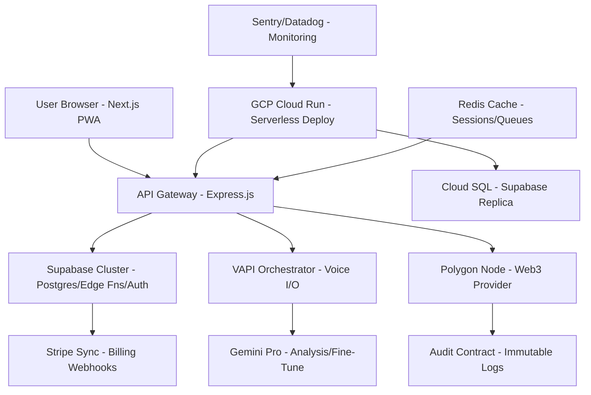

## 5. Technical Architecture & Stack

### High-Level Diagram (Enhanced Text + Mermaid for Gemini)

*(Gemini Prompt: "Render this Mermaid diagram as SVG for docs.")*

### Detailed Stack (with Versions & Patterns)
- **Frontend:** Next.js 14.2 (App Router, Turbopack dev); TypeScript 5.5; Tailwind 3.4; Zustand 4.5 (persist middleware); React Flow 12 for editor; PWA via next-pwa.
- **Backend:** Express 4.19 (TS via @types/express); ESM native; Middleware: Helmet (security), Rate-Limiter-Flexible (100 req/min), CORS (origin whitelist).
- **Database/Auth:** Supabase 2.0 (Postgres 15; RLS policies; JWT with 1h expiry + refresh); Edge Functions (Deno) for webhooks.
- **Voice Layer:** VAPI 1.1 (REST for outbound, WebSockets for realtime; Custom models via SSML); Fallback: ElevenLabs for TTS if VAPI down.
- **Payments:** Stripe 2025-09-01 API (Metered billing: $0.04/min base + $0.01/min premium voices); Webhooks: `invoice.paid` → Credit quota.
- **AI/ML:** Gemini 1.5 Pro/Flash (CLI for local dev; API rate: 60 RPM); Fine-tuning: 100-domain transcripts; Drift detect: Weekly perplexity score.
- **Blockchain:** ethers 6.13 (Wallet connect); Polygon RPC (Alchemy provider); Multicall3 for batch.
- **Infra:** GCP Cloud Run (CPU 1 vCPU, 512MiB mem; Auto-scale 0-1000); Artifact Registry; Secret Manager for keys.
- **DevOps:** GitHub Actions CI/CD (lint/test/deploy); ESLint + Prettier; Vitest for unit (90% coverage).

**Security Patterns:**
- Auth: Supabase JWT + Row-Level everywhere; CSRF via double-submit cookies.
- Encryption: At-rest (Supabase); In-transit (TLS 1.3); PII zero-trust (client-only decrypt).
- OWASP: Input sanitization (zod schemas); SQL inj via prepared stmts.

**Error Handling (Resilience Framework):**
- Global: Try-catch → Sentry capture → User toast (categorize: 4xx user-error, 5xx retry).
- VAPI Fail: Exponential backoff (3x, 1-5s); Fallback: SMS via Twilio ("Call rescheduled – reply STOP").
- DB Deadlock: Retry with pg-advisory-lock.